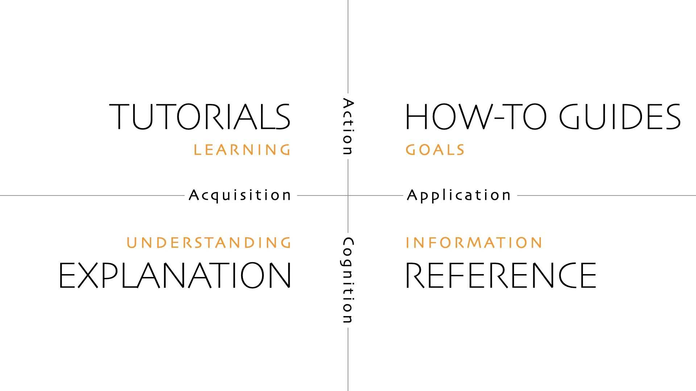

# Diátaxis

本书原作者为 [Daniele Procida](https://vurt.eu/) 。原书发布在 [diataxis.fr](https://diataxis.fr/) 网站上，由 Hugo HU 翻译，最后校对日期为 2023.12.29 ，如果发现译文有错误或译文落后于源文本请通过本仓库 [issues](https://github.com/librehugohu/librehugohu.github.io/issues) 反馈或通过 [E-Mail](mailto:librehugohu@outlook.com) 联系我改正。

Diátaxis 是技术文档创作的系统方法。

---

> Diátaxis，源自古希腊语δῐᾰ́τᾰxiῐς：dia（“跨越”）和taxi（“安排”）。

Diátaxis 是一种思考和创作文档的方式。

它规定了文档内容、体系结构和形式的方法，这些方法是从理解文档读者需求的系统方法中产生的。

Diátaxis 确定了四种不同的需求，以及四种相应形式的文档——教程（tutorials）、操作指南（how-to guides）、技术参考（technical reference）和解释（explanation）。它将它们置于系统关系中，并建议文档本身应该围绕满足这些需求的结构进行组织。

Diátaxis 解决与文档内容（写什么）、风格（如何写）和架构（如何组织）相关的问题。

除了为文档读者提供服务外，Diátaxis 对于文档创建者和维护者也很有价值。它既轻量级，又易于掌握、易于应用。它不施加实施限制。它为文档带来了积极的质量原则，帮助维护人员有效地思考自己的工作。

## 内容

该网站分为两个主要部分，以帮助应用和理解 Diátaxis。

这部分的页面将有助于立即、具体地理解该方法。

* 应用 Diátaxis
  * 教程（Tutorials）
  * 操作指南（How-to guides）
  * 参考（Reference）
  * 解释（Explanation）
  * 指南针
  * Diátaxis 作为工作指南

本节更深入地探讨了 Diátaxis 的理论和原则，并阐述了对支撑其基础的需求的理解。

* 理解 Diátaxis
  * 基础
  * 地图
  * 走向文档质量理论
  * 教程（tutorials）和操作指南（how-to guides）
  * 参考（reference）和解释（explanation）
  * 复杂层次结构中的 Diátaxis

Diátaxis 已在实践中得到证明。它的原则已在数百个文档项目中成功应用。

> 在 Gatsby，我们最近重新组织了我们的开源文档，Diátaxis 框架是我们整个项目的首选资源。这四个象限帮助我们优先考虑每种类型文档的用户目标。通过围绕 Diátaxis 框架重组我们的文档，我们使用户在需要时更容易发现他们需要的资源。（[梅根·沙利文](https://hachyderm.io/@meganesulli)）

> 在重新设计 Cloudflare 开发人员文档时，Diátaxis 成为我们信息架构的北极星。当我们不确定新内容应该放在哪里时，我们会查阅框架。对于读者和贡献者来说，我们的文档现在比以往任何时候都更加清晰。（[亚当·施瓦茨](https://github.com/adamschwartz)）
